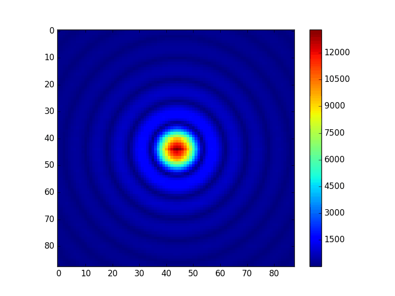

# PCSPSF

<div style="text-align: center">
	
	
</div>

## Overview

This package reconstructs the instrumental PSF after image-slicing. 

In brief, for each wavelength within the range specified:

1. A dummy telescope pupil is created
2. The conjugate image of this pupil is constructed
3. The image is sliced up, and for each slice
  * The image is moved into pupil space
  * The WFE from the collimator and/or camera are added by addition of the corresponding Zemax phase maps corresponding to the field position for each slice
  * The resulting aberrated pupil is moved back into image space
4. All slices are stitched together to make the composite image

## Dependencies

- Zemax
- PyZDDE
- XPA (optional)
- pyds9 (optional)

and the ELT-PCS packages:

- zSpec
- zController
- instrument_builder


Dependencies should be pulled from the ELT-PCS repositories so that the distribution has the following structure. This is your responsibility - submodules are not supported:

```
PCSPSF
├───etc
├───examples
├───scripts
├───instrument_builder
└───zSpec
    └───zController
```

## Running the Simulation

To run the simulation with the default configuration file (`etc\default.ini`):

`python go.py -f cube.fits -c -v`

Command-line arguments to `go.py` are described by setting the standard help toggle, `-h`.

## Programmatic Methodology

The package is instantiated by running `go.py`. This script sets up the simulation parameters required by the `sim` class in `simulation.py`. A separate instance of this class is created for each wavelength in the given range. The process is synchronous however, and must remain so to avoid race conditions when interacting with Zemax.

The primary data structures used in the simulation are the `pupil` and `image` classes. These are base classes that are designed to be overriden by more specific geometries, namely circular, described in the corresponding child classes with a suffix of `_circular`.

Both of the bases classes and their children have a method allowing movement between their respective conjugate optical spaces:

* image plane -> pupil plane, use `image.toConjugatePupil()`
* pupil plane -> image plane, use `pupil.toConjugateImage()`

The `instrument_builder` package is used to determine the entrance slit positions for calculation of WFE. More details can be found in its README, but modularising this into another package allows for different arrangements of the IFU exit slit to be considered.

The `zSpec` package is used to retrieve the WFE maps from Zemax programatically. Communication is made via the `PyZDDE`interface, not the ZOS-API.

The code is heavily commented in-line.

## Configuration

A commented sample configuration file, `default.ini`, can be found in `etc`. Parameters should be fairly intuitive, but be sure to use absolute paths for Zemax files.

## Caveats and Gotchas

Be wary of the distinction between the class cslice() and variables with "slice" in their name. The former represents a datacube slice, and the latter a slice of an image. It should be fairly obvious which is which contextually.

The width of a single slice must be an integer number of pixels. This just makes it easier for everyone, namely me.

No consideration is currently given to anamorphic preoptics (variables disregarded in configuration files, assumed none).

No consideration is currently given to the number of spectrographs when constructing the exit slit of the IFU (variables disregarded in configuration files, assumed 1).


